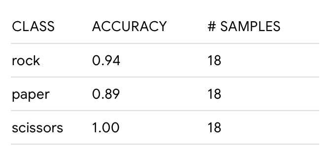
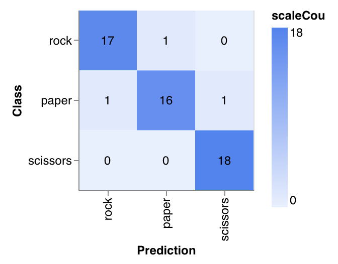
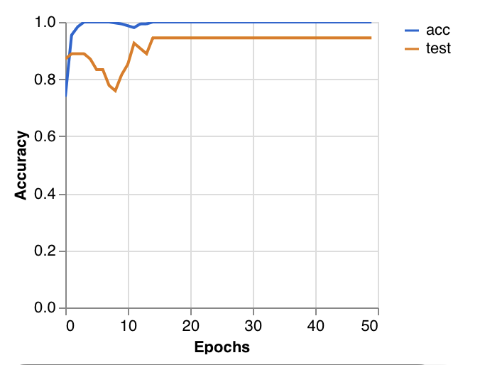
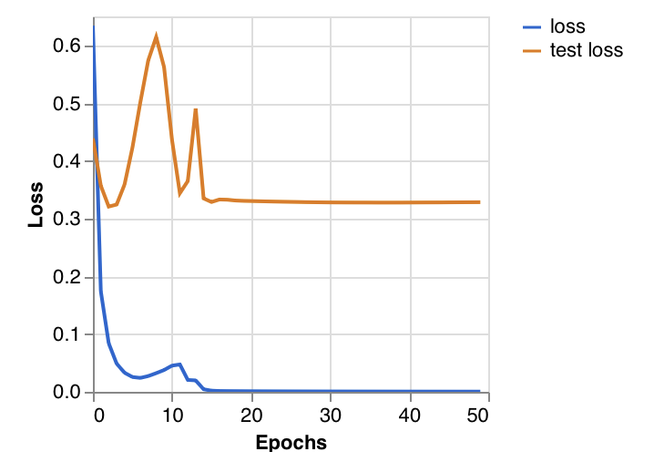

# Rock-Paper-Scissors Dataset

This repository contains an image dataset and a trained model for **Rock-Paper-Scissors hand gesture classification**.

## Table of Contents

1. [Dataset](#1-dataset)
2. [Dataset Diversity](#2-dataset-diversity)
3. [Data Augmentation](#3-data-augmentation)
4. [Augmented Dataset](#4-augmented-dataset)
5. [Training Results](#5-training-results)

## 1. Dataset

The dataset contains three classes:

* **Rock**
* **Paper**
* **Scissors**

The original images are stored in the `datasets/` directory.

### 1.1 Original Dataset

The original dataset contains **210 images**:

| Class     | Number of Images |
| --------- | ----------------: |
| Rock      |                70 |
| Paper     |                70 |
| Scissors  |                70 |
| **Total** |           **210** |

## 2. Dataset Diversity

When preparing the dataset, we considered variation in the visual appearance and recording conditions of the images. The dataset includes differences such as:

* **Different skin tones and hand appearances**, helping the model learn the gestures across a range of people rather than relying on one specific appearance.
* **Accessories**, such as rings, bracelets, watches, or other items that may appear on or near the hand.
* **Different backgrounds**, including variation in the environment surrounding the hand.
* **Different lighting and image conditions**, resulting in differences in brightness, shadows, and contrast.
* **Different hand positions and orientations**, providing variation in how the gestures are presented to the camera.

These variations are important because, in real-world use, the same Rock, Paper, or Scissors gesture may be presented by different people and under different environmental conditions.

## 3. Data Augmentation

Data augmentation was applied to increase the variability of the dataset while keeping the original images unchanged.

The augmentation was implemented using **Python and the Pillow (PIL) library**. For each original image, one augmented version was generated using the following, randomly applied transformations:

| Transformation           | Range                                            |
| ------------------------- | ------------------------------------------------- |
| Horizontal flipping       | 50% probability                                    |
| Rotation                  | -15° to +15°                                      |
| Brightness adjustment     | 85% to 115% of the original                        |
| Contrast adjustment       | 85% to 115% of the original                        |
| Random cropping/zooming   | 90% to 100% of the original image area, then resized back to its original dimensions |

These transformations introduce additional variation in orientation, lighting, contrast, and image framing while keeping the Rock, Paper, and Scissors gestures recognizable.

## 4. Augmented Dataset

The augmented dataset is stored in the `augmented_dataset/` directory.

Each original image was preserved alongside its augmented version.

| Class     | Original Images | Augmented Images |   Total |
| --------- | ---------------: | ------------------: | -------: |
| Rock      |                60 |                   60 |      120 |
| Paper     |                59 |                   61 |      120 |
| Scissors  |                61 |                   59 |      120 |
| **Total** |           **180** |              **180** |  **360** |

The augmented dataset therefore contains **360 images in total**.

> **Note:** After `augment.py` was run, manual changes were made to the images (additions/removals), which is why the original and augmented counts above are not perfectly even and no longer match `datasets/` exactly. The counts above reflect what is currently on disk.

### 4.1 File Naming

The augmented dataset contains two versions of each image:

* `*_original.jpg` — the original image
* `*_augmented.jpg` — the transformed version of the original image

The original dataset was not modified during augmentation.

## 5. Training Results

The model was trained for 50 epochs and evaluated on a held-out test set of 54 images (18 per class).

### 5.1 Accuracy per Class

| Class    | Accuracy | # Samples |
| -------- | -------: | --------: |
| Rock     |     0.94 |        18 |
| Paper    |     0.89 |        18 |
| Scissors |     1.00 |        18 |

### 5.2 Confusion Matrix

Scissors were classified perfectly, while a small number of Rock and Paper images were confused with each other.

### 5.3 Accuracy per Epoch

Training accuracy converges quickly to ~1.00, while test accuracy stabilizes around 0.94 after roughly 15 epochs.

### 5.4 Loss per Epoch

Training loss decreases steadily toward 0, while test loss stabilizes around 0.33 after an initial period of fluctuation.

## 6. Source

The original Rock-Paper-Scissors images used as the basis for this project were sourced from the following Kaggle dataset:

- [Rock Paper Scissors Dataset – Kaggle](https://www.kaggle.com/datasets/alexandredj/rock-paper-scissors-dataset)

The dataset was subsequently processed, organized, augmented, and modified for this project. The training results presented in this repository are based on the dataset version and preprocessing pipeline described above.
